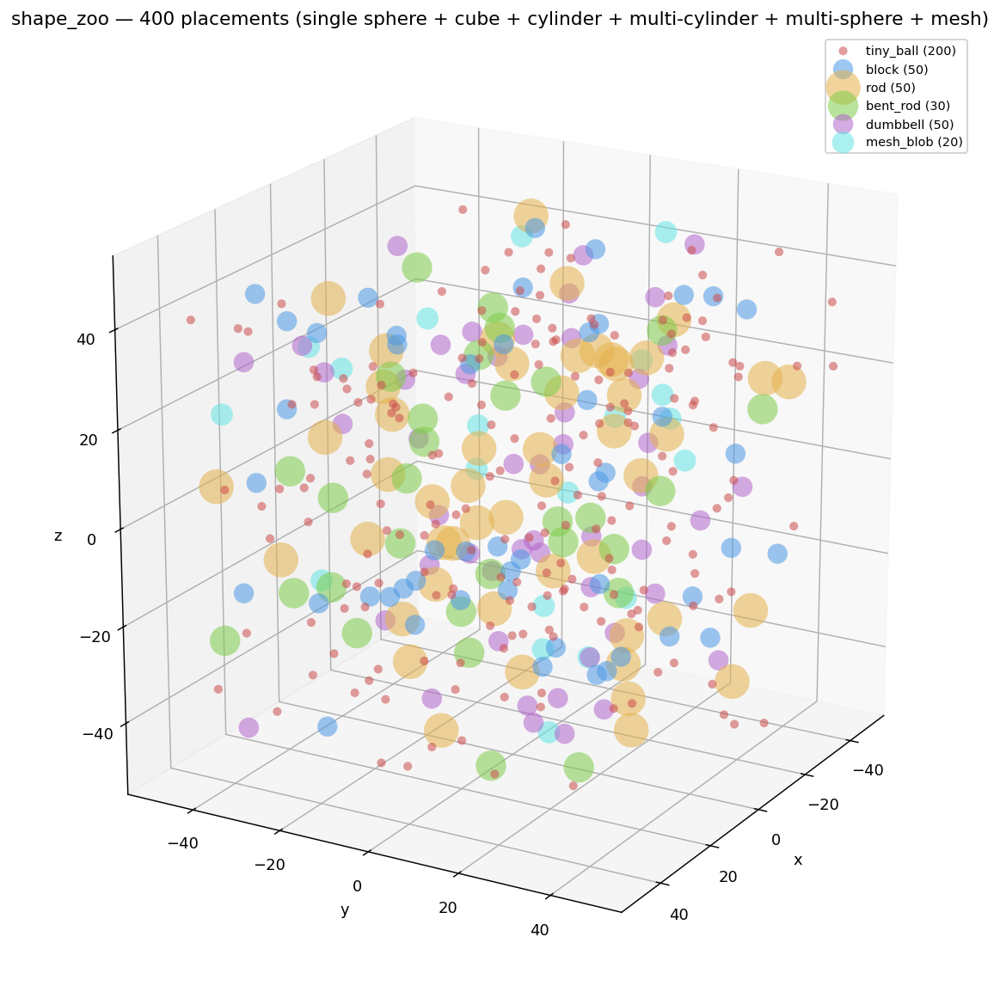
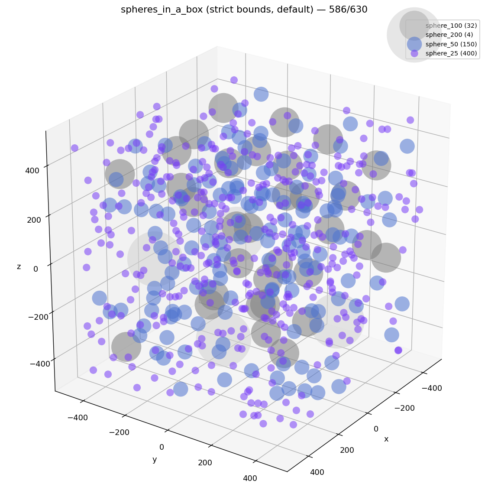
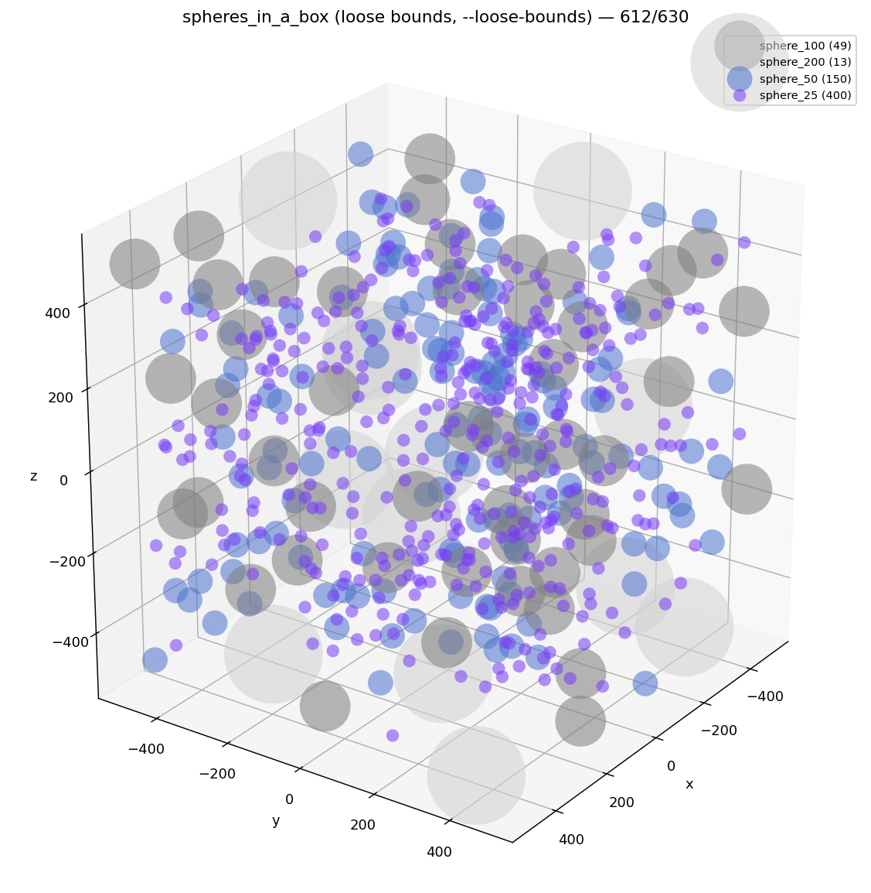
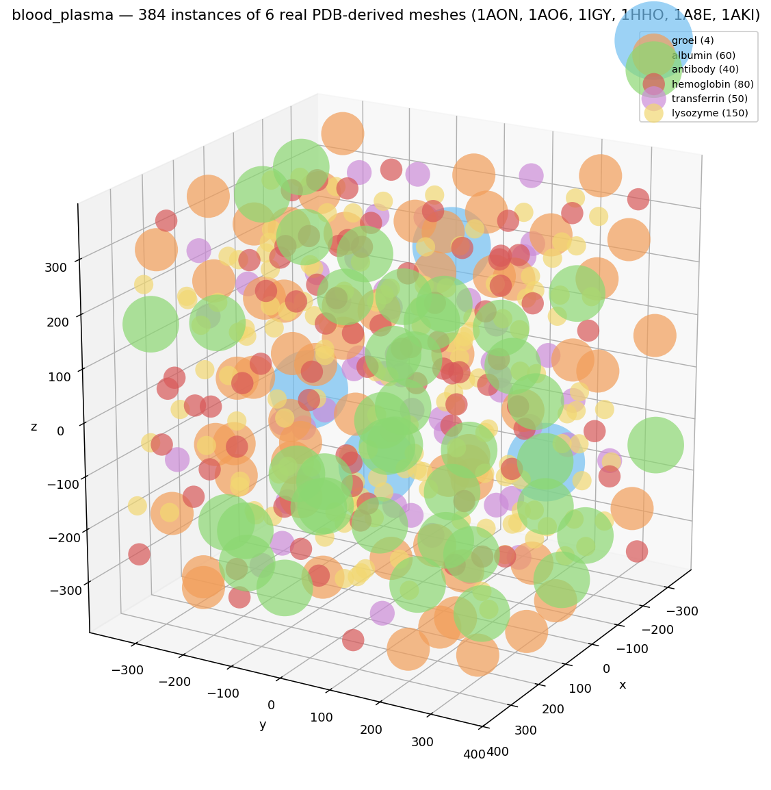
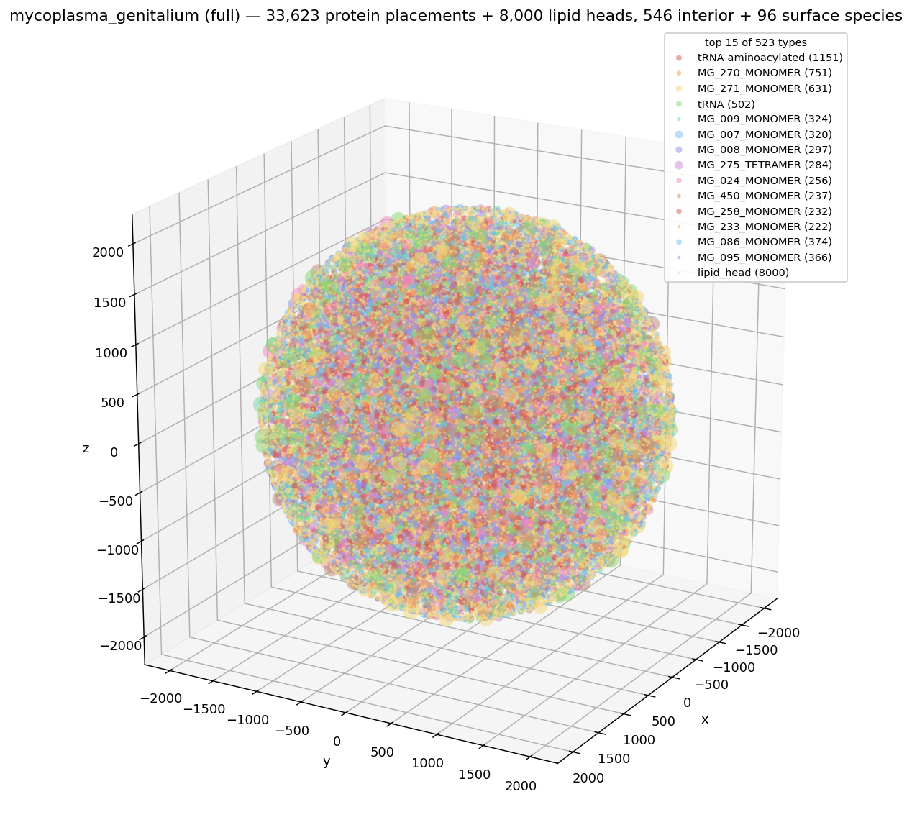
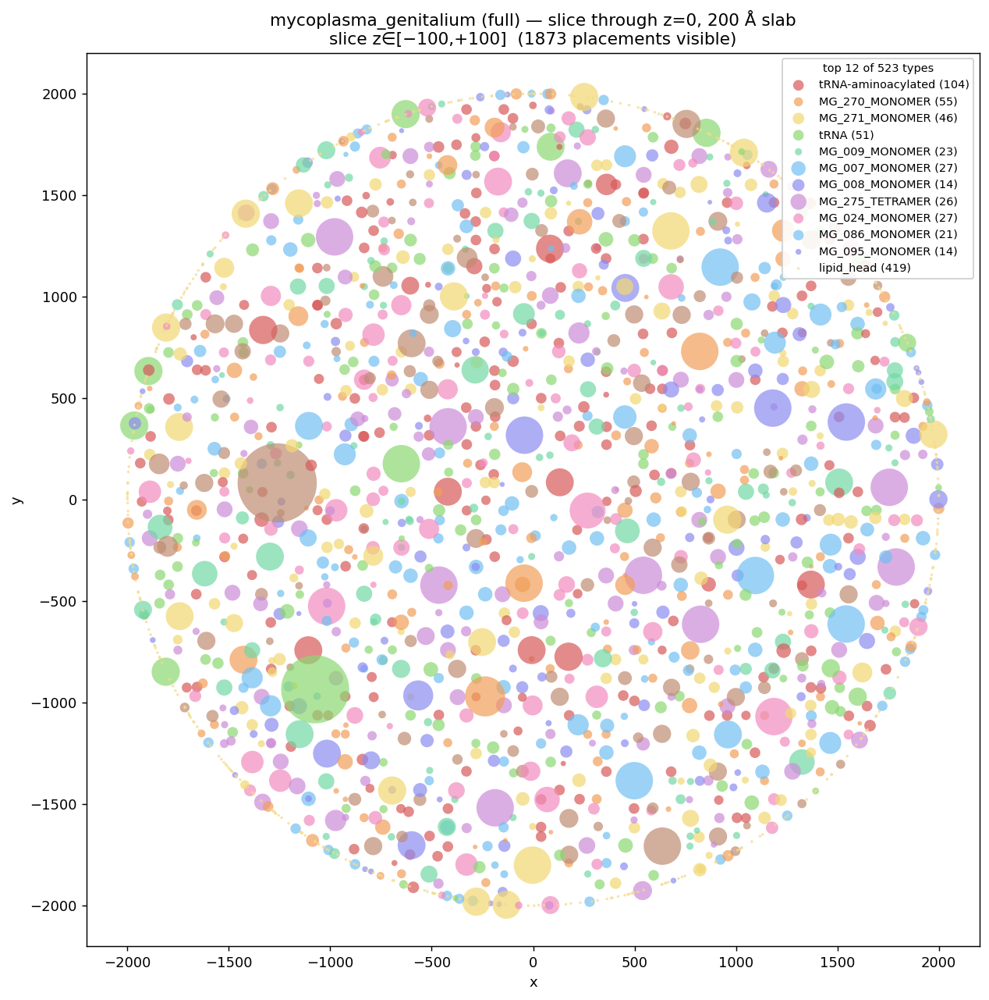

# parsimony — feature status

**Date:** 2026-05-20 · **Tests passing:** 162 · **Workspace crates:** 5

A Rust reimagining of cellPACK. Reads cellPACK v2 JSON recipes, packs
molecular ingredients into compartments, and emits its own pack format
(plus optional Simularium export). Two interchangeable placement
engines: a **clearance grid + per-directive valid-cell lists +
slack-bounded jitter** (cellPACK's method, `--backend legacy`, the
default) and a **content-scaled sparse occupancy octree**
(`--backend octree`) that shares one tree across all directives —
~5× faster at whole-cell scale. See *Performance* below.

> **Viewing this report on Ubuntu:** the embedded PNGs in
> `docs/img/` are referenced with standard markdown image syntax
> (``), so any markdown renderer that resolves
> relative paths will show them.
>
> Easiest: **`parsimony report`** — a live grip preview (GitHub-style,
> ephemeral uv venv, no global install). Or export a standalone file
> with **`parsimony report --html --open`** (pandoc if present, else
> grip's exporter). Both resolve the relative image paths.
>
> Manual options:
>
> - **uv + grip** (one command, no global pollution):
>   `uvx grip docs/REPORT.md` → opens `http://localhost:6419`.
> - **VSCode**: `code docs/REPORT.md`, then Ctrl+Shift+V (or Ctrl+K V
>   for side-by-side).
> - **gnome-text-editor / typora / obsidian** — open the file from
>   inside this repo so the relative image paths resolve.

---

## Demos

Three live demos, all packing without overlap on a single thread.

### `shape_zoo` — every ingredient shape parsimony supports



```
recipe: shape_zoo (6 ingredient types, 6 directives, 400 instances requested)
packed: 400/400 instances in 141.57ms  (100%)
  total attempts: 400, success rate: 100.0%
  tiny_ball     200/200   (single_sphere, radius 1.5)
  block          50/50    (single_cube, size 4³)
  rod            50/50    (single_cylinder, length 10, radius 1.0)
  bent_rod       30/30    (multi_cylinder, two-segment Y)
  dumbbell       50/50    (multi_sphere, two-sphere proxy)
  mesh_blob      20/20    (mesh, OBJ loaded from examples/meshes/sphere.obj)
```

One pack run exercises `single_sphere`, `single_cube`, `single_cylinder`,
`multi_cylinder`, `multi_sphere`, and an OBJ-loaded mesh ingredient —
all going through the same QBVH + clearance-grid pipeline. The 100%
success rate means every loop iteration committed a placement.

### `spheres_in_a_box` — strict vs loose bounds

cellPACK's classic dense-packing benchmark, run both ways.

| | **strict bounds (default)** | **`--loose-bounds` (cellPACK match)** |
|---|---|---|
| |  |  |
| packed | 586/630 (93%) | 612/630 (97%) |
| sphere_200 | 4/20 | 13/20 |
| sphere_100 | 32/60 | 49/60 |
| sphere_50 | 150/150 | 150/150 |
| sphere_25 | 400/400 | 400/400 |
| wall time | 8.82 ms | 12.34 ms |
| success rate | 99.7% | 99.7% |

cellPACK gets 613/630 (sphere_200: 18, sphere_100: 45) on this recipe
by allowing centres anywhere inside the box (spheres protrude at the
edge). With `--loose-bounds` parsimony reproduces that semantics and
matches their density within rounding. The default behaviour is
strict — sphere fully inside box — which is biology-correct (relevant
when the bounding box represents a real container rather than just
the simulation domain).

### `blood_plasma` — real PDB protein meshes



```
recipe: blood_plasma (6 ingredient types, 6 directives, 384 instances requested)
packed: 384/384 instances in 692ms  (100%)
  lysozyme     150/150   (1AKI — small antibacterial enzyme, ~30 Å)
  hemoglobin    80/80    (1HHO — α₂β₂ tetramer, ~55 Å)
  albumin       60/60    (1AO6 — primary plasma carrier, ~80 Å)
  transferrin   50/50    (1A8E — iron transport, ~60 Å)
  antibody      40/40    (1IGY — Y-shape IgG, ~150 Å)
  groel          4/4     (1AON — 14-mer chaperonin, ~200 Å)
```

Mixed real protein structures fetched from RCSB and converted to Van
der Waals surface meshes by the native mesher (`parsimony mesh`: a VdW
SDF + surface nets, no Python). Demonstrates parsimony's mesh-ingredient pipeline
end-to-end with structures that are decidedly *not* sphere-shaped —
the Y-armed antibody and the hollow GroEL barrel both pack cleanly.

### `mycoplasma_genitalium` (full) — translated from the Maritan et al. recipe




```
recipe: mycoplasma_genitalium — 688 objects: 552 interior + 130 surface species,
        plus dna_segment / rna_segment / lipid-patch / RNA+DNA polymerases
pack:   89,414 placements — 48,719 instanced dsDNA segments (chromosome),
        16,000 real-lipid bilayer patches (membrane), 3,870 tiled A-RNA
        segments (mRNA), ~20,800 protein / tRNA / rRNA instances
```

Translated from [ccsb-scripps/MycoplasmaGenitalium](https://github.com/ccsb-scripps/MycoplasmaGenitalium)
(the cellPACK data backing Maritan, Singla, Autin, Karr, Covert,
Olson & Goodsell, *J Mol Biol* 2022, "Building Structural Models of
a Whole Mycoplasma Cell"). `parsimony translate-mycoplasma` clones that
data repo, walks their JSON recipe, finds (or fetches from RCSB) the
structure for every species, batch-converts them to Van der Waals meshes
(atomic SDF + surface nets), and emits a parsimony recipe — all in native
Rust, no Python.

- **Interior**: 552 cytoplasmic species placed inside the cell sphere.
- **Surface**: 130 membrane-protein species placed on the cell-sphere boundary
  via parsimony's Surface region (with `principal_vector` alignment
  to surface normals).
- **Membrane**: a real phospholipid bilayer. Each surface placement is one
  mesh *patch* — a hex-packed disc of ~250 real LHG (phosphatidylglycerol)
  lipids, mirrored tail-to-tail with the phosphate heads oriented outward —
  tiled with a random in-plane roll over the cell sphere. ~16,000 patches
  stand in for ~4 million lipids at a tiny instance count.
- **Chromosome + RNA**: the full genome as a genome-driven supercoiled fiber,
  rendered as tens of thousands of instances of a real B-DNA dodecamer (1BNA)
  tiled + twisted along the path; mRNA the same way (a real A-RNA segment,
  1RNA, tiled along each strand), with bound RNA/DNA polymerases.
- **Cell**: a 2,000 Å sphere compartment (Mycoplasma genitalium is
  ~150–200 nm diameter; the larger sphere gives the proteins room).
- **Structures**: every species — and the DNA/RNA/lipid segments — is a real
  PDB/mmCIF structure VdW-meshed by the native pipeline. Structures the
  cellPACK data repo references but doesn't ship are fetched from RCSB, so no
  species are skipped.

---

## Performance vs cellPACK

Two comparisons, both single-threaded on the same machine (Linux 6.8,
Tuxedo workstation):

1. **vs the original cellPACK** on recipes small enough for cellPACK to
   finish — the apples-to-apples validation that we pack the *same*
   thing, much faster.
2. **legacy vs octree backend** at whole-cell scale, where cellPACK
   doesn't realistically run — the comparison that motivates the new
   engine.

Reproduce #1 with `parsimony compare <recipe>` (packs both backends in
process, runs cellPACK from `../cellpack/.venv`, prints the table); #2
with `parsimony pack <recipe> --backend legacy|octree`.

### 1 · vs original cellPACK

`spheres_in_a_box` — cellPACK's classic dense benchmark (630 requested:
60 sphere_100 + 20 sphere_200 + 150 sphere_50 + 400 sphere_25 in a
1000³ box). parsimony in loose-bounds mode to match cellPACK's
centre-in-box containment:

| | parsimony legacy (loose) | cellPACK (Python, jitter) | ratio |
|---|---|---|---|
| **Wall time** | **~19 ms** | **31.5 s** | **~1 600× faster** |
| Placements | 612/630 (97%) | 613/630 (97%) | matched |
| Attempts | 614 | many thousands (each cell-rejection retries) | ~10–100× fewer |
| Sample success | 99.7% | ≪10% on dense recipes | grid is authoritative |
| sphere_200 | 13/20 | 18/20 | within rounding |
| sphere_100 | 49/60 | 45/60 | within rounding |

`one_sphere` — the trivial single-placement recipe, run live through
`parsimony compare` (both backends + cellPACK):

```
parsimony-legacy   1 placement   ~0.3–2 ms
parsimony-octree   1 placement   ~0.5–2 ms
cellpack           1 placement   ~4–6 s
```

On a trivial recipe the gap is even wider (thousands ×) and noisy —
cellPACK's multi-second Python/NumPy startup alone dwarfs parsimony's
sub-millisecond pack. The representative figure is the dense
`spheres_in_a_box` above: matched density, ~1 600× the speed. (cellPACK's
`spheres_in_a_box` run is flaky to launch headless on this box; its
31.5 s is the established prior measurement, so the live `compare`
corroboration uses `one_sphere`.)

#### Where the speed comes from

cellPACK is Python with NumPy hot loops; parsimony is release-mode
Rust. But the algorithmic differences matter at least as much:

- **Sample success.** cellPACK admits cells where the sphere *might*
  fit and verifies with a per-attempt grid scan; most attempts fail and
  retry. The legacy backend's strict `clearance ≥ radius` filter +
  slack-bounded jitter makes the grid authoritative — every iteration
  commits.
- **No per-attempt collision check (legacy).** Interior placements skip
  the QBVH and cellPACK's grid scan entirely; the jitter bound proves
  no overlap can happen.
- **f32 distance grid, not quantised.** cellPACK's per-attempt
  `collision_jitter` scans O(radius³/cell³) grid points per placement;
  parsimony does one `min(stored, |c−p|−r)` pass over the affected
  cells at placement time, then nothing per attempt.
- **Sphere-tree pairwise check** is exact and tight — no quantization,
  no extraneous overlap tolerance.

### 2 · legacy vs octree at whole-cell scale

Both backends pack the full cell — legacy isn't broken. The octree is an
*optimisation*, and (correcting an earlier draft of this report) the win
is **not** the clearance grid's 500-cells/axis memory cap: that cap is
never reached here. The largest complex's ~374 Å enclosing radius sets a
~55 Å cell, so the mycoplasma grid is only ~74³ ≈ 405k cells (~1.6 MB) —
coarse and small, nowhere near the 500³ ceiling.

What costs the legacy engine at this scale is per-directive,
grid-resolution work the octree avoids:

- It (re)builds a **per-directive** valid-cell list (cellPACK's
  `allIngrPts`), and because that grid (~405k cells) is below the
  `MAX_VALID_CELLS` (500k) fast-path threshold, each build is a **full
  scan of the whole compartment grid** — repeated for all ~680 directives
  and again whenever a directive's list empties.
- Every placement updates a grid neighbourhood sized by
  `r + max_required_radius`, i.e. by the **largest** ingredient (~374 Å)
  even for a tiny protein.

The octree shares **one** tree across all directives and touches only the
occupied/free frontier of each actual sphere — so it sidesteps both. A
*bigger/finer* grid would slow legacy down and cost more memory, not
speed it up; the dense grid's volume-scaled memory only bites at far
larger or sparser domains (tissue scale), which is where the octree's
content scaling becomes load-bearing rather than merely faster.

Since that comparison the cell has grown far heavier — 682 species VdW-meshed at
1.5 Å (not 2.5 Å), plus an instanced chromosome, lipid bilayer patches, and
tiled mRNA — so absolute times are no longer comparable to the older 632-species
/ 2.5 Å run. The qualitative result only sharpens: as placed content grows, the
octree's content scaling pulls away from the grid's volume-scaled, per-directive
work until `legacy` stops being practical. Full cell, seed 0, `--proxy-lod 2`:

| full cell · octree · `--proxy-lod 2` | placed | wall | peak RAM |
|---|---|---|---|
| single-shot `pack` | 36,980 / 43,486 (85%) | 5:49 | 13.5 GB |
| staged `pipeline` (recommended) | comparable | ~2:00 | ~7 GB |

`pack` builds every collision proxy up front; the pipeline stages the build
(chromosome → membrane → fiber proteins → densified interior) and content-caches
each stage, landing the same cell in ~3× less wall time at roughly half the peak
RAM. The `legacy` backend did **not** finish the full cell in a practical time
at this scale and was abandoned — its per-directive valid-cell rebuilds and
largest-ingredient grid neighbourhoods (above) don't amortise once content
dominates the box. (The 85% placed is the densest-species saturation gap, not a
backend limit.)

On small/sparse recipes the trade-off still runs the other way: there the grid's
slack-bound (≈1 attempt per placement, ~99.7% success) beats the octree's
cheaper-but-more-numerous attempts. So the default stays `legacy`; reach for
`--backend octree` and the staged pipeline on whole-cell recipes — it's what
`mycoplasma_full` uses.

---

## Feature inventory

What parsimony does today, mapped to where it lives in the workspace.

### Ingredient shapes  (`crates/parsimony-core/src/ingredient.rs`)

| Recipe `type:` | Internal representation | Sphere-tree size |
|---|---|---|
| `single_sphere` | `IngredientShape::SingleSphere` | 1 |
| `multi_sphere` | `IngredientShape::MultiSphere` | user-defined |
| `single_cube` | converts to `MultiSphere` via `cube_proxies` | 8 octant spheres, radius ‖h‖/2 |
| `single_cylinder` | converts to `MultiSphere` via `cylinder_proxies` | overlapping chain along local Z |
| `multi_cylinder` | converts to `MultiSphere` via `multi_cylinder_proxies` | concatenated chains |
| `mesh` | `IngredientShape::Mesh` (parry3d `TriMesh` + voxelised proxies) | one sphere per interior voxel |

Random SO(3) rotation per placement via Shoemake's method, applied to
proxy offsets. `enclosing_radius`, `world_spheres`, `needs_rotation`
are uniform across variants.

OBJ loader is a ~30-line vertex-and-face parser
(`ingredient::obj::load_trimesh`) — no external crate; supports negative
indices and fan-triangulates polygonal faces.

### Compartment kinds  (`crates/parsimony-core/src/compartment.rs`)

| Recipe `kind:` | `CompartmentKind` variant | Signed-distance impl | Surface sampling |
|---|---|---|---|
| `box` | `Box(Aabb)` | per-axis min | area-weighted face pick |
| `sphere` | `Sphere { center, radius }` | `radius − ‖p−c‖` | uniform unit-sphere direction |
| `capsule` | `Capsule { a, b, radius }` | analytical capsule SDF | hemisphere ends + cylinder side |
| `mesh` | `Mesh(MeshCompartment)` | parry3d `project_local_point` | barycentric on area-weighted triangle |

`signed_distance(p)` (positive inside, negative outside) is the unifying
primitive — used both for `fits_sphere` and to bound jitter at sample
time so jittered points stay inside the compartment by ≥ radius.

Nested compartments are supported (parent/child pointers in
`Compartment`), with child exclusion in the placer so an "interior"
directive for a parent never lands inside one of its children.

### Recipe format  (`crates/parsimony-core/src/recipe.rs`)

- cellPACK v2 JSON loads directly (verified via the actual
  `spheres_in_a_box.json` from the cellpack repo).
- Object inheritance (`inherit`) resolved with cycle detection.
- `count` or `molarity` (Avogadro × volume conversion, matches
  cellPACK's `Recipe.setCount`).
- Composition tree walked into a flat list of `PlacementDirective`s.
- Nested analytical compartments via inline `compartment: { kind: ... }`
  (parsimony extension — cellPACK uses mesh files only).
- Mesh ingredients and mesh compartments accept paths resolved
  relative to the recipe file's parent directory.

### Placement algorithm  (`crates/parsimony-core/src/placer.rs`)

- `GreedyRandomPlacer` — cellPACK's `jitter_place`, simplified.
- Per-directive `valid_cells: Vec<u32>` (cellPACK's `allIngrPts`).
  Built initially by scanning the compartment AABB, kept clean by
  lazy stale-removal during sampling, rebuilt on emptiness.
- Sampling: pick random entry from the list; per-axis jitter bounded
  by `slack/√3` (capped at `cell_size/2`), where slack is the minimum
  of clearance-to-nearest-sphere, distance-to-compartment-boundary,
  and distance-to-each-child-boundary.
- That bound is what makes the clearance grid **mathematically
  authoritative** — no QBVH collision check needed for Interior
  placements. Surface placements (which don't go through the grid)
  use a strict QBVH check with a consecutive-rejection cap.
- Uniform random over live directives (cellPACK's default
  `pickIngredient`).
- `PlacerConfig::strict_bounds` toggles loose (centre-in-box) vs
  strict (sphere-fully-in-box) containment of the root compartment.
- **Two interchangeable backends** behind `PlacerConfig::backend`
  (`parsimony pack --backend legacy|octree`). `legacy` (default) is
  the clearance-grid engine described here — cellPACK's method, with
  the slack-bound making the grid authoritative. `octree` swaps the
  grid + valid-cell lists for a sparse occupancy octree (below); the
  two share the recipe walk, chromosome pass, and Surface/tiled
  handling.

### Occupancy octree  (`crates/parsimony-core/src/octree.rs`)

The clearance grid answers "where can this land?" by enumerating empty
*volume* — a dense f32 cell per `cell_size³`, plus a derived free-cell
list per directive. Its cost is set by the box, not by what's placed,
and it builds one valid-cell list **per directive** (×630 on the full
*Mycoplasma* recipe). The occupancy octree answers the same question
with cost that scales with *content*:

- One sparse tree per compartment, **shared across every directive**.
  Starts as a single empty root and subdivides **only near placed
  geometry** — big empty regions stay one coarse leaf; the interior of
  a placed blob collapses back to one `full` leaf; only the
  occupied/free frontier refines down to `min_cell` (same
  `max_radius/8` policy as the grid).
- Each node caches the **free volume** in its subtree, so
  `sample_free` descends weighted toward free space and lands in a
  known-free leaf — preserving near-direct placement at high density
  (where blind rejection would need thousands of tries) without the
  grid's volume price.
- `insert_sphere` / `overlaps` / `sample_free` updated incrementally
  as placement proceeds; `overlaps` is an exact proxy-vs-proxy test, so
  the main pass and the proxy-accurate densify collapse into **one
  loop** (no separate clearance grid, valid-cell list, or densify
  stage). A freed-block arena recycles collapsed subtrees so the node
  count tracks peak *live* content.
- Unit test `node_count_scales_with_content_not_volume` pins the
  invariant: the same placement in a 64×-bigger box refines to the same
  order of magnitude of nodes.

Trade-off vs the grid: the octree re-checks every candidate against the
tree (lower per-attempt success — more, cheaper attempts), where the
grid's slack-bound lets it skip that check (≈1 attempt per placement).
At whole-cell scale the octree's content scaling wins on wall time
anyway (see *Performance* below); on a small sparse box the grid is
more efficient.

### Clearance grid  (`crates/parsimony-core/src/clearance_grid.rs`)

- Dense `Vec<f32>` storing distance from each cell centre to the
  nearest placed sphere's surface. `f32::INFINITY` = free, `0.0` =
  occupied, positive = clearance.
- Cell size auto-derived from the recipe's largest ingredient radius
  (≈ `radius / 8`). Capped at 500 cells per axis (≤ 500 MB worst case).
- `update_for_placement(p, r, max_r)` writes `min(stored, |c−p| − r)`
  into every cell within range, branch-free.

### Spatial index  (`crates/parsimony-spatial`)

- `QbvhIndex` — 4-wide SIMD BVH via `wide::f32x4`, SoA cell AABBs,
  native incremental insert / remove / update.
- `BruteIndex` — correctness oracle, kept for property-test cross-check.
- `VoxelField` — 3-level sparse hierarchical voxel field (16³ L1, 8³
  L0), constant-tile compression, plus mesh voxeliser
  (`voxelize_trimesh`, `prepare_trimesh_for_voxelize`).
- Common `SpatialIndex` trait abstracts the three.

### Output  (`crates/parsimony-core/src/output.rs`)

- Simularium JSON (viewer-compatible) — full `trajectoryInfo` +
  `spatialData` with type-mapped colours.
- Plain transform-list JSON (`name`, `placements: [{position,
  rotation, ingredient}]`) for downstream tooling.

### CLI / bench  (`crates/parsimony-cli`, `crates/parsimony-bench`)

- `parsimony pack <recipe> --out <path> [--backend legacy|octree]
  [--loose-bounds] [--seed N]` — pack one recipe.
- `parsimony compare <recipe>` — packs **both** parsimony backends in
  process and (if `../cellpack/.venv` is present) cellPACK too, then
  prints a side-by-side table of placements, wall time, per-radius
  counts, and position spread. The validation harness.
- `parsimony pipeline run <pipeline.json> [--force] [--relax N]` —
  staged packing as a build system (chromosome → membrane → fibers →
  densified interior), each stage content-addressed and cached;
  `pipeline status` shows fresh/stale, `pipeline clean` empties the
  cache to start over.
- `parsimony mesh <pdb|dir>` — PDB/CIF → LOD OBJ meshes.
- `parsimony demos regenerate` / `parsimony viewer` — rebuild the demo
  packs and serve the local three.js viewer.

---

## Test inventory

162 tests passing across the workspace (`cargo test --release`). Clippy
is clean in the CLI; a handful of pedantic style lints remain in the
actively-developed core modules.

| Crate / file | Tests | Coverage |
|---|---|---|
| `parsimony-spatial` (lib) | 87 | AABB, brute index, QBVH, voxel field, mesh voxeliser, queries |
| `parsimony-core` (lib) | 59 | recipe loader, compartments, both placement backends, octree, fiber, pipeline, relax, output |
| `parsimony-core` tests/ `ecoli_starter.rs` | 5 | E. coli starter recipe packs + invariants |
| `parsimony-core` tests/ `shape_zoo.rs` | 3 | every shape type present, ≥90% packed, no overlaps |
| `parsimony-core` tests/ `spheres_in_a_box.rs` | 7 | loads cellPACK recipe, no overlaps, within bounds, deterministic, simularium + transforms output well-formed |
| `parsimony-gpu` (lib) | 1 | GPU clearance-grid update matches CPU oracle |

Selected test names (full list runnable via `cargo test --release`):

```
shape_zoo_packs_everything                       (>=90%)
shape_zoo_no_overlaps                            (across all 6 shape types)
shape_zoo_includes_every_shape_type              (sphere + multi + mesh)
no_overlaps_in_packing                           (spheres_in_a_box)
all_inside_bounding_box                          (strict bounds asserted)
loose_bounds_allows_protrusion                   (verifies the loose flag does what it says)
places_into_nested_capsule_with_surface_region   (nested capsule + surface)
deterministic_same_seed_same_output              (bit-for-bit determinism)
loads_real_spheres_in_a_box_from_cellpack        (cellPACK recipe round-trips)
loads_single_cube / loads_single_cylinder / loads_multi_cylinder
loads_mesh_ingredient_from_local_obj
loads_mesh_compartment_from_local_obj
```

---

## Algorithm sketch

For every iteration:

1. **Pick a directive** uniformly at random over those that still
   have instances to place and aren't stuck. (cellPACK's default
   `pickIngredient`.)
2. **Sample a candidate position.** For Interior directives, pick a
   random cell from the directive's `valid_cells` list. Each cell is
   one that, at build time, had `clearance ≥ radius` AND was
   ≥ `radius` inside the compartment AND ≥ `radius` outside every
   child compartment. Lazy stale-removal pops cells whose clearance
   has since dropped. For Surface directives, sample on the
   compartment surface (area-weighted face / triangle pick + uniform
   barycentric).
3. **Slack-bounded jitter.** Per-axis jitter `j ∈ [−m, m]` where
   `m = min(sphere_slack, compartment_slack, child_slack) / √3`,
   capped at half a cell. The `/√3` factor caps worst-case
   Euclidean displacement at the smallest slack, so the jittered
   point stays ≥ radius from every forbidden surface. **This is the
   load-bearing invariant** — it lets us skip the downstream
   collision check entirely for Interior placements.
4. **Place.** Insert into QBVH (broad-phase index for Surface
   queries), update the clearance grid (writes `min(stored, |c−p|−r)`
   for cells within range of the new sphere — every proxy sphere of
   a multi-sphere ingredient updates separately).
5. **Stuck detection.** A directive whose `valid_cells` list empties,
   even after a rebuild, is marked stuck and dropped from the live
   set. A Surface directive that hits a consecutive-rejection cap is
   marked stuck similarly.

The result is mathematically overlap-free and converges in
~one-placement-per-iteration: typical demos run at 99–100% sample
success rate (every iteration commits a placement). See the per-demo
"success rate" numbers above.

---

## GPU foundation (Phase 4 — in flight)

`crates/parsimony-gpu/` exists. wgpu 23 backend, one compute pipeline:
`clearance_update.wgsl` ports the CPU clearance-grid update to the
GPU. One workgroup per placement (64 threads cooperating on the
affected cell range), `atomicMin` on the f32 bit-pattern of the
distance value (sound because the grid never stores negative
numbers).

Oracle test `gpu_matches_cpu_oracle` cross-checks: 64 random
placements onto a 32³ grid via the GPU pipeline match the CPU
reference (`cpu_update` in the same crate, byte-equivalent to
`parsimony-core/src/clearance_grid.rs::update_for_placement`) to
within FP noise. Passes on the test machine's GPU; will skip
gracefully if no adapter is available.

Next on this path:
- Wire `GpuClearanceGrid` into the placer behind a `--gpu` flag so
  the Mycoplasma 33,623-placement pack can use it for the load-time
  proxy voxelisation. Benchmark against the current 82 s.
- Move per-directive `valid_cells` filter to GPU (one prefix-sum +
  compact pass per directive).
- Eventually: collision queries via parallel sphere-tree-vs-sphere-
  tree against a GPU-resident QBVH.

---

## What's still deferred

These are real gaps relative to cellPACK, but discrete features we can
add when a recipe needs them:

- **Priority-based weighted ingredient picking** (cellPACK's
  `pickWeightedIngr`). Useful when one ingredient must place before
  others; we always uniform-random.
- **Close-packing mode** (cellPACK's `packing_mode: close`). Picks
  cells in a narrow clearance band for cytoplasmic-crowding style
  packings.
- **Gradient packing** (concentration gradients along a vector).
- **Mesh-vs-sphere exact collision.** Currently mesh ingredients
  collide via their sphere-tree proxies; the underlying `TriMesh`
  is retained for future exact narrow-phase via parry3d.
- **Additional output formats** beyond Simularium (PDB, SIF, OBJ
  scene export).
- **GPU acceleration** for the clearance-grid update + collision check
  (Phase 4 in the design doc).
- **Prism integration** (parsimony as a Value/Process type in the
  user's bigraph runtime).

---

## How to reproduce

```bash
# All tests
cargo test --release

# Packs (any recipe path) — pick the engine with --backend
cargo run --release -p parsimony-cli -- pack \
    examples/recipes/shape_zoo.json --out /tmp/x.pack.json
cargo run --release -p parsimony-cli -- pack \
    examples/recipes/mycoplasma_full.json --backend octree --out /tmp/full.pack.json

# Compare both backends + cellPACK on one recipe (cellpack venv at ../cellpack/.venv)
cargo run --release -p parsimony-cli -- compare \
    ../cellpack/examples/recipes/v2/spheres_in_a_box.json

# Whole-cell octree-vs-legacy numbers in this report (seed 0)
cargo run --release -p parsimony-cli -- pack examples/recipes/mycoplasma.json \
    --backend legacy --out /tmp/myco_legacy.pack.json
cargo run --release -p parsimony-cli -- pack examples/recipes/mycoplasma.json \
    --backend octree --out /tmp/myco_octree.pack.json

# Re-render report images (matplotlib pulled into an ephemeral uv env on
# first run; needs a .simularium input — pack with --format simularium).
cargo run --release -p parsimony-cli -- pack \
    examples/recipes/shape_zoo.json --format simularium --out /tmp/x.simularium
cargo run --release -p parsimony-cli -- render /tmp/x.simularium docs/img/x.png \
    --title "demo" --slice z --slice-thickness 80

# View this report — live preview, or export standalone HTML
cargo run --release -p parsimony-cli -- report
cargo run --release -p parsimony-cli -- report --html --open

# Regenerate the whole-cell recipe + meshes from cellPACK data (clones on
# first run), then pack and view it in the local three.js viewer
cargo run --release -p parsimony-cli -- translate-mycoplasma
cargo run --release -p parsimony-cli -- viewer --recipe examples/recipes/shape_zoo.json
```

---

## Where things live

```
crates/parsimony-spatial/    # AABB, BVH (brute + QBVH SIMD), VoxelField, mesh voxeliser
crates/parsimony-core/       # recipe loader, ingredients, compartments, placer, output
  src/ingredient.rs            # IngredientShape + shape_helpers + obj loader
  src/compartment.rs           # CompartmentKind + signed_distance + surface sampling
  src/clearance_grid.rs        # f32 distance field (legacy backend)
  src/octree.rs                # sparse occupancy octree (octree backend)
  src/placer.rs                # both placement backends + chromosome/fiber/surface
  src/pipeline.rs              # staged packing (DAG + content-addressed cache)
  src/relax.rs                 # post-merge clash relaxation
  src/recipe.rs                # JSON loader + composition walker
  src/output.rs                # pack.v1 + Simularium + transforms emitters
crates/parsimony-cli/        # the `parsimony` binary — every command below
                             #   pack / compare / pipeline / mesh / demos / viewer
                             #   translate-mycoplasma / render / report
crates/parsimony-gpu/        # wgpu clearance-grid update (Phase 4)
crates/parsimony-bench/      # cellPACK comparison harness (parse + runner + compare)
examples/recipes/            # shape_zoo.json, blood_plasma.json, mycoplasma.json, pdb_proteins.json
examples/meshes/             # sphere.obj (toy mesh-ingredient demo)
examples/pdb_meshes/         # generated VdW meshes — gitignored (regenerated by `mesh` / `translate-mycoplasma`)
examples/pdb_cache/          # PDB/mmCIF fetched from RCSB — gitignored (re-fetched on demand)
docs/                        # this report, parsimony-design.md, img/*.png
viewer/                      # local three.js viewer (HTML + JS); viewer/data/*.pack.json generated (gitignored)
scripts/                     # peripheral helpers (mesh, translate, and the viewer's static server are now native Rust):
  render_simularium.py       #   Simularium → static PNG (matplotlib)    (parsimony render)
  purge-generated.sh         #   drop generated artifacts from git history (one-time repo cleanup)
```
