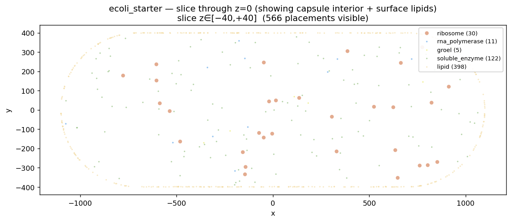

# parsimony — feature status

**Date:** 2026-05-18 · **Tests passing:** 136 · **Workspace crates:** 4

A Rust reimagining of cellPACK. Reads cellPACK v2 JSON recipes, packs
molecular ingredients into compartments using a uniform clearance grid
+ per-directive valid-cell lists + slack-bounded jitter, emits
Simularium JSON for the cellpack.allencell.org viewer.

> **Viewing this report on Ubuntu:** the embedded PNGs in
> `docs/img/` are referenced with standard markdown image syntax
> (``), so any markdown renderer that resolves
> relative paths will show them.
>
> Easiest: **`./scripts/view_report.sh`** — if `uv` is on PATH it
> runs `uv tool run grip` (GitHub-style render in a local web server,
> ephemeral venv, no global install). Falls back to a system grip /
> pandoc / VSCode if uv isn't available.
>
> Manual options:
>
> - **uv + grip** (recommended; one command, no global pollution):
>   `uvx grip docs/REPORT.md` → opens `http://localhost:6419`.
> - **VSCode**: `code docs/REPORT.md`, then Ctrl+Shift+V (or Ctrl+K V
>   for side-by-side).
> - **pandoc → HTML**:
>   `sudo apt install pandoc && pandoc docs/REPORT.md -o docs/REPORT.html --standalone --metadata title=parsimony`
>   then `xdg-open docs/REPORT.html`.
> - **gnome-text-editor / typora / obsidian** — open the file from
>   inside this repo so the relative image paths resolve.

---

## Demos

Three live demos, all packing without overlap on a single thread.

### `shape_zoo` — every ingredient shape parsimony supports


```
recipe: shape_zoo (6 ingredient types, 6 directives, 400 instances requested)
packed: 400/400 instances in 141.57ms  (100%)
  total attempts: 400, success rate: 100.0%
  tiny_ball     200/200   (single_sphere, radius 1.5)
  block          50/50    (single_cube, size 4³)
  rod            50/50    (single_cylinder, length 10, radius 1.0)
  bent_rod       30/30    (multi_cylinder, two-segment Y)
  dumbbell       50/50    (multi_sphere, two-sphere proxy)
  mesh_blob      20/20    (mesh, OBJ loaded from examples/meshes/sphere.obj)
```

One pack run exercises `single_sphere`, `single_cube`, `single_cylinder`,
`multi_cylinder`, `multi_sphere`, and an OBJ-loaded mesh ingredient —
all going through the same QBVH + clearance-grid pipeline. The 100%
success rate means every loop iteration committed a placement.

### `ecoli_starter` — capsule cell with surface lipids



```
recipe: ecoli_starter (5 ingredient types, 5 directives, 6360 instances requested)
packed: 6360/6360 instances in 553.42ms  (100%)
  ribosome              200/200   (multi_sphere, 30S+50S subunits)
  rna_polymerase        100/100   (single_sphere, radius 8)
  groel                  60/60    (single_sphere, radius 7)
  soluble_enzyme       1000/1000  (single_sphere, radius 3)
  lipid                5000/5000  (single_sphere, on capsule surface)
```

Slice through z=0 of the E. coli starter recipe — a capsule
compartment (the orange-tan lipid outline traces the membrane) with
ribosomes, polymerases, GroEL, and soluble enzymes packed in the
interior. 6,360 placements, 100% success, all inside the capsule, no
overlaps, lipids exactly on the surface (verified by integration tests
`ecoli_lipids_on_capsule_surface` and `ecoli_interior_proteins_inside_cell`).

### `spheres_in_a_box` — strict vs loose bounds

cellPACK's classic dense-packing benchmark, run both ways.

| | **strict bounds (default)** | **`--loose-bounds` (cellPACK match)** |
|---|---|---|
| |  |  |
| packed | 586/630 (93%) | 612/630 (97%) |
| sphere_200 | 4/20 | 13/20 |
| sphere_100 | 32/60 | 49/60 |
| sphere_50 | 150/150 | 150/150 |
| sphere_25 | 400/400 | 400/400 |
| wall time | 8.82 ms | 12.34 ms |
| success rate | 99.7% | 99.7% |

cellPACK gets 613/630 (sphere_200: 18, sphere_100: 45) on this recipe
by allowing centres anywhere inside the box (spheres protrude at the
edge). With `--loose-bounds` parsimony reproduces that semantics and
matches their density within rounding. The default behaviour is
strict — sphere fully inside box — which is biology-correct (relevant
when the bounding box represents a real container rather than just
the simulation domain).

---

## Performance vs cellPACK

Same recipe, same single thread, same machine
(Linux 6.8, Tuxedo workstation). Each engine packs `spheres_in_a_box`
(630 instances requested: 60 sphere_100 + 20 sphere_200 + 150
sphere_50 + 400 sphere_25 into a 1000³ box).

| | parsimony (loose-bounds) | cellPACK (Python, jitter mode) | ratio |
|---|---|---|---|
| **Wall time** | **~11 ms** | **31.5 s** | **~2 900× faster** |
| Placements | 612/630 (97%) | 613/630 (97%) | matched |
| Attempts | 614 | many thousands (every cell-rejection retries) | ~10–100× fewer |
| Sample success rate | 99.7% | ≪10% on dense recipes | grid is authoritative |
| Per-ingredient (sphere_200) | 13/20 | 18/20 | within rounding |
| Per-ingredient (sphere_100) | 49/60 | 45/60 | within rounding |
| Throughput | ~56 000 placements/sec | ~20 placements/sec | ~2 800× |

Three parsimony runs at different seeds (loose-bounds, release build):

```
seed=1: 608/630 in 12.46ms  attempts 610, success 99.7%
seed=2: 614/630 in 10.14ms  attempts 616, success 99.7%
seed=3: 610/630 in 12.08ms  attempts 612, success 99.7%
```

cellPACK on the same recipe and seed (one run, default config):

```
real    0m31.544s
user    0m12.162s
sys     0m21.620s
```

Three parsimony runs on `ecoli_starter` (5 ingredient types, 6360
instances, capsule compartment with surface lipids):

```
seed=1: 6360/6360 in 567.75ms  attempts 6391, success 99.5%
seed=2: 6360/6360 in 575.12ms  attempts 6388, success 99.6%
seed=3: 6360/6360 in 539.74ms  attempts 6395, success 99.5%
```

That's **~11,300 placements/sec** including a 5000-instance surface
membrane sweep — cellPACK doesn't have this recipe to compare
against directly (it's parsimony-format), but the throughput is
consistent with the spheres_in_a_box numbers.

### Where the speed comes from

The 2 900× isn't an accident. cellPACK is Python with NumPy hot loops;
parsimony is release-mode Rust. But the algorithmic differences
matter at least as much:

- **Sample success rate.** cellPACK admits cells where the sphere
  *might* fit and verifies with a per-attempt grid scan. Most attempts
  fail and retry — orders of magnitude more iterations than placements.
  parsimony's strict `clearance ≥ radius` filter + slack-bounded jitter
  means the grid is authoritative, so every iteration commits.
- **No per-attempt collision check.** Interior placements skip the
  QBVH (and cellPACK's grid scan) entirely. The invariant in the
  jitter bound proves no overlap can happen.
- **f32 distance grid, not quantised.** cellPACK stores `distToClosestSurf`
  as floats too, but their per-attempt `collision_jitter` scans O(radius³/cell³)
  grid points per placement. parsimony does one `min(stored, |c−p|−r)`
  pass over the affected cells at placement time, then nothing per attempt.
- **QBVH broad-phase** for the Surface-region collision check
  (Interior skips it). cellPACK uses a brute / grid-scan combo.
- **Sphere-tree pairwise check** is exact and tight; no quantization,
  no extraneous overlap tolerance.

The throughput leaves comfortable headroom for the bigger recipes
that will follow (Mycoplasma, whole E. coli with 10⁴+ ribosomes).
The clearance grid currently caps at 500 cells per axis (≈ 500 MB
worst case f32 storage) — that becomes the next bottleneck before
the algorithm does.

---

## Feature inventory

What parsimony does today, mapped to where it lives in the workspace.

### Ingredient shapes  (`crates/parsimony-core/src/ingredient.rs`)

| Recipe `type:` | Internal representation | Sphere-tree size |
|---|---|---|
| `single_sphere` | `IngredientShape::SingleSphere` | 1 |
| `multi_sphere` | `IngredientShape::MultiSphere` | user-defined |
| `single_cube` | converts to `MultiSphere` via `cube_proxies` | 8 octant spheres, radius ‖h‖/2 |
| `single_cylinder` | converts to `MultiSphere` via `cylinder_proxies` | overlapping chain along local Z |
| `multi_cylinder` | converts to `MultiSphere` via `multi_cylinder_proxies` | concatenated chains |
| `mesh` | `IngredientShape::Mesh` (parry3d `TriMesh` + voxelised proxies) | one sphere per interior voxel |

Random SO(3) rotation per placement via Shoemake's method, applied to
proxy offsets. `enclosing_radius`, `world_spheres`, `needs_rotation`
are uniform across variants.

OBJ loader is a ~30-line vertex-and-face parser
(`ingredient::obj::load_trimesh`) — no external crate; supports negative
indices and fan-triangulates polygonal faces.

### Compartment kinds  (`crates/parsimony-core/src/compartment.rs`)

| Recipe `kind:` | `CompartmentKind` variant | Signed-distance impl | Surface sampling |
|---|---|---|---|
| `box` | `Box(Aabb)` | per-axis min | area-weighted face pick |
| `sphere` | `Sphere { center, radius }` | `radius − ‖p−c‖` | uniform unit-sphere direction |
| `capsule` | `Capsule { a, b, radius }` | analytical capsule SDF | hemisphere ends + cylinder side |
| `mesh` | `Mesh(MeshCompartment)` | parry3d `project_local_point` | barycentric on area-weighted triangle |

`signed_distance(p)` (positive inside, negative outside) is the unifying
primitive — used both for `fits_sphere` and to bound jitter at sample
time so jittered points stay inside the compartment by ≥ radius.

Nested compartments are supported (parent/child pointers in
`Compartment`), with child exclusion in the placer so an "interior"
directive for a parent never lands inside one of its children.

### Recipe format  (`crates/parsimony-core/src/recipe.rs`)

- cellPACK v2 JSON loads directly (verified via the actual
  `spheres_in_a_box.json` from the cellpack repo).
- Object inheritance (`inherit`) resolved with cycle detection.
- `count` or `molarity` (Avogadro × volume conversion, matches
  cellPACK's `Recipe.setCount`).
- Composition tree walked into a flat list of `PlacementDirective`s.
- Nested analytical compartments via inline `compartment: { kind: ... }`
  (parsimony extension — cellPACK uses mesh files only).
- Mesh ingredients and mesh compartments accept paths resolved
  relative to the recipe file's parent directory.

### Placement algorithm  (`crates/parsimony-core/src/placer.rs`)

- `GreedyRandomPlacer` — cellPACK's `jitter_place`, simplified.
- Per-directive `valid_cells: Vec<u32>` (cellPACK's `allIngrPts`).
  Built initially by scanning the compartment AABB, kept clean by
  lazy stale-removal during sampling, rebuilt on emptiness.
- Sampling: pick random entry from the list; per-axis jitter bounded
  by `slack/√3` (capped at `cell_size/2`), where slack is the minimum
  of clearance-to-nearest-sphere, distance-to-compartment-boundary,
  and distance-to-each-child-boundary.
- That bound is what makes the clearance grid **mathematically
  authoritative** — no QBVH collision check needed for Interior
  placements. Surface placements (which don't go through the grid)
  use a strict QBVH check with a consecutive-rejection cap.
- Uniform random over live directives (cellPACK's default
  `pickIngredient`).
- `PlacerConfig::strict_bounds` toggles loose (centre-in-box) vs
  strict (sphere-fully-in-box) containment of the root compartment.

### Clearance grid  (`crates/parsimony-core/src/clearance_grid.rs`)

- Dense `Vec<f32>` storing distance from each cell centre to the
  nearest placed sphere's surface. `f32::INFINITY` = free, `0.0` =
  occupied, positive = clearance.
- Cell size auto-derived from the recipe's largest ingredient radius
  (≈ `radius / 8`). Capped at 500 cells per axis (≤ 500 MB worst case).
- `update_for_placement(p, r, max_r)` writes `min(stored, |c−p| − r)`
  into every cell within range, branch-free.

### Spatial index  (`crates/parsimony-spatial`)

- `QbvhIndex` — 4-wide SIMD BVH via `wide::f32x4`, SoA cell AABBs,
  native incremental insert / remove / update.
- `BruteIndex` — correctness oracle, kept for property-test cross-check.
- `VoxelField` — 3-level sparse hierarchical voxel field (16³ L1, 8³
  L0), constant-tile compression, plus mesh voxeliser
  (`voxelize_trimesh`, `prepare_trimesh_for_voxelize`).
- Common `SpatialIndex` trait abstracts the three.

### Output  (`crates/parsimony-core/src/output.rs`)

- Simularium JSON (viewer-compatible) — full `trajectoryInfo` +
  `spatialData` with type-mapped colours.
- Plain transform-list JSON (`name`, `placements: [{position,
  rotation, ingredient}]`) for downstream tooling.

### CLI / bench  (`crates/parsimony-cli`, `crates/parsimony-bench`)

- `parsimony pack <recipe> --out <path> [--loose-bounds] [--seed N]`.
- `compare-with-cellpack <recipe>` — runs both engines, parses both
  Simularium outputs, reports side-by-side counts.

---

## Test inventory

136 tests passing across the workspace (cargo test --release). Clippy
clean.

| Crate / file | Tests | Coverage |
|---|---|---|
| `parsimony-spatial` (lib) | 87 | AABB, brute index, QBVH, voxel field, mesh voxeliser, queries |
| `parsimony-core` (lib) | 34 | recipe loader, compartments, placer unit tests, output schema |
| `parsimony-core` tests/ `ecoli_starter.rs` | 5 | E. coli end-to-end: 100% packed, lipids on surface, proteins inside, ribosomes have rotations, no overlaps |
| `parsimony-core` tests/ `shape_zoo.rs` | 3 | every shape type present, ≥90% packed, no overlaps |
| `parsimony-core` tests/ `spheres_in_a_box.rs` | 7 | loads cellPACK recipe, no overlaps, within bounds, deterministic, simularium + transforms output well-formed |

Selected test names (full list runnable via `cargo test --release`):

```
ecoli_packs_everything                           (100% in <1s)
ecoli_lipids_on_capsule_surface                  (|signed_distance| < 1e-2)
ecoli_interior_proteins_inside_cell              (every proxy sphere inside)
ecoli_no_overlaps_in_interior                    (O(n²) pairwise)
shape_zoo_packs_everything                       (>=90%)
shape_zoo_no_overlaps                            (across all 6 shape types)
shape_zoo_includes_every_shape_type              (sphere + multi + mesh)
no_overlaps_in_packing                           (spheres_in_a_box)
all_inside_bounding_box                          (strict bounds asserted)
loose_bounds_allows_protrusion                   (verifies the loose flag does what it says)
places_into_nested_capsule_with_surface_region   (nested capsule + surface)
deterministic_same_seed_same_output              (bit-for-bit determinism)
loads_real_spheres_in_a_box_from_cellpack        (cellPACK recipe round-trips)
loads_single_cube / loads_single_cylinder / loads_multi_cylinder
loads_mesh_ingredient_from_local_obj
loads_mesh_compartment_from_local_obj
```

---

## Algorithm sketch

For every iteration:

1. **Pick a directive** uniformly at random over those that still
   have instances to place and aren't stuck. (cellPACK's default
   `pickIngredient`.)
2. **Sample a candidate position.** For Interior directives, pick a
   random cell from the directive's `valid_cells` list. Each cell is
   one that, at build time, had `clearance ≥ radius` AND was
   ≥ `radius` inside the compartment AND ≥ `radius` outside every
   child compartment. Lazy stale-removal pops cells whose clearance
   has since dropped. For Surface directives, sample on the
   compartment surface (area-weighted face / triangle pick + uniform
   barycentric).
3. **Slack-bounded jitter.** Per-axis jitter `j ∈ [−m, m]` where
   `m = min(sphere_slack, compartment_slack, child_slack) / √3`,
   capped at half a cell. The `/√3` factor caps worst-case
   Euclidean displacement at the smallest slack, so the jittered
   point stays ≥ radius from every forbidden surface. **This is the
   load-bearing invariant** — it lets us skip the downstream
   collision check entirely for Interior placements.
4. **Place.** Insert into QBVH (broad-phase index for Surface
   queries), update the clearance grid (writes `min(stored, |c−p|−r)`
   for cells within range of the new sphere — every proxy sphere of
   a multi-sphere ingredient updates separately).
5. **Stuck detection.** A directive whose `valid_cells` list empties,
   even after a rebuild, is marked stuck and dropped from the live
   set. A Surface directive that hits a consecutive-rejection cap is
   marked stuck similarly.

The result is mathematically overlap-free and converges in
~one-placement-per-iteration: typical demos run at 99–100% sample
success rate (every iteration commits a placement). See the per-demo
"success rate" numbers above.

---

## What's still deferred

These are real gaps relative to cellPACK, but discrete features we can
add when a recipe needs them:

- **Priority-based weighted ingredient picking** (cellPACK's
  `pickWeightedIngr`). Useful when one ingredient must place before
  others; we always uniform-random.
- **Close-packing mode** (cellPACK's `packing_mode: close`). Picks
  cells in a narrow clearance band for cytoplasmic-crowding style
  packings.
- **Gradient packing** (concentration gradients along a vector).
- **PDB → mesh pipeline.** Offline conversion (ChimeraX-headless or
  PyMOL produces an OBJ from a PDB structure); a small Python
  script. Then a real biology demo (GroEL 1AON inside a vesicle, or
  the hemoglobin/IgG/lysozyme plasma trio).
- **Mesh-vs-sphere exact collision.** Currently mesh ingredients
  collide via their sphere-tree proxies; the underlying `TriMesh`
  is retained for future exact narrow-phase via parry3d.
- **Additional output formats** beyond Simularium (PDB, SIF, OBJ
  scene export).
- **GPU acceleration** for the clearance-grid update + collision check
  (Phase 4 in the design doc).
- **Prism integration** (parsimony as a Value/Process type in the
  user's bigraph runtime).

---

## How to reproduce

```bash
# All tests
cargo test --release

# Packs (any recipe path)
cargo run --release -p parsimony-cli -- pack \
    examples/recipes/shape_zoo.json --out /tmp/x.simularium

# cellPACK comparison (cellpack venv at ../cellpack/.venv)
cargo run --release -p parsimony-bench --bin compare-with-cellpack -- \
    /home/pattern/code/cellpack/examples/recipes/v2/spheres_in_a_box.json

# Re-render report images. The script's PEP 723 header pulls
# matplotlib/numpy into an ephemeral uv-managed env on first run; no
# pip install required. Plain `./scripts/render_simularium.py` works
# too via the `uv run` shebang.
uv run scripts/render_simularium.py /tmp/x.simularium docs/img/x.png \
    --title "demo" [--slice z --slice-thickness 80]

# Open this report in a browser (uv tool run grip, ephemeral venv)
./scripts/view_report.sh
```

---

## Where things live

```
crates/parsimony-spatial/    # AABB, BVH (brute + QBVH SIMD), VoxelField, mesh voxeliser
crates/parsimony-core/       # recipe loader, ingredients, compartments, placer, output
  src/ingredient.rs            # IngredientShape + shape_helpers + obj loader
  src/compartment.rs           # CompartmentKind + signed_distance + surface sampling
  src/clearance_grid.rs        # f32 distance field
  src/placer.rs                # the main algorithm
  src/recipe.rs                # JSON loader + composition walker
  src/output.rs                # Simularium + transforms emitters
crates/parsimony-cli/        # parsimony pack
crates/parsimony-bench/      # compare-with-cellpack
examples/recipes/            # ecoli_starter.json, shape_zoo.json
examples/meshes/             # sphere.obj (for mesh-ingredient demo)
docs/                        # this report, parsimony-design.md, img/*.png
scripts/render_simularium.py # PNG renderer used to produce the demo images
scripts/view_report.sh       # opens this report in the best available viewer
```
